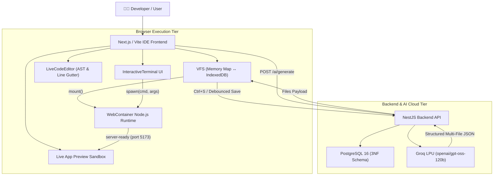

# 🏗️ Bolt.ai - Decoupled System Architecture & Technical Design

## 1. Core Architectural Paradigm

Bolt.ai implements a clean separation of concerns across client and server tiers:

- **WebContainer**: In-browser Node.js development runtime (`npm install`, `npm run dev`, Vite server, process execution).
- **VFS (Virtual File System)**: High-speed in-memory `Map<string, ProjectFile>` backed asynchronously by `IndexedDB`.
- **NestJS Backend**: Secure API orchestration, PostgreSQL 3NF persistence, and authentication.
- **Groq LPU (GPT-OSS 120B)**: Server-side AI code generation engine producing structured multi-file outputs.
- **Terminal UI**: Streamed frontend for WebContainer subprocesses.



---

## 2. Component Boundaries & Responsibilities

### A. WebContainer — The In-Browser Development Machine
WebContainer is **not** an AI or database engine. It acts as the local browser development machine:
1. Receives the `FileSystemTree` from VFS: `webcontainer.mount(tree)`.
2. Runs native Node.js package commands: `webcontainer.spawn('npm', ['install'])`.
3. Starts the local Vite development server: `webcontainer.spawn('npm', ['run', 'dev'])`.
4. Emits `server-ready` event pointing the preview iframe to the live running application.

### B. VFS (Virtual File System) — Project File Management
- **In-Memory Cache**: Active editing happens directly against `Map<string, ProjectFile>` for sub-millisecond AST updates.
- **IndexedDB Persistence**: Asynchronously persists workspace snapshots with debouncing to prevent UI blocking.
- **AST Analyzer**: Continuously computes line numbers, byte sizes, imports, exports, and React hooks.

### C. Server-Side AI Pipeline (NestJS + Groq LPU)
- **Security**: The Groq API key (`gsk_...`) is kept strictly on the backend.
- **Structured Response Format**: AI returns multi-file payloads rather than monolithic text:
  ```json
  {
    "files": [
      { "path": "package.json", "content": "..." },
      { "path": "src/App.tsx", "content": "..." },
      { "path": "src/components/Header.tsx", "content": "..." }
    ]
  }
  ```
- **VFS Ingestion**: `fileManager.clearAndSetProjectFiles(response.files)` updates the VFS and triggers an automatic WebContainer remount.

### D. Terminal UI — Real WebContainer Subprocess Streaming
- Terminal commands (`npm test`, `npm run build`, `git status`, `ls`) are dispatched to `webcontainer.spawn(cmd, args)` rather than simulated in mock parsers.
- `stdout` and `stderr` streams are piped directly into the terminal line display.

### E. PostgreSQL 3NF Persistence
- **Cadence**: Database synchronization occurs on explicit project save (`Ctrl+S`), deployment triggers, or project snapshot intervals—**never** on raw keystrokes.
- **Normalized Schema**: Eliminates redundancy across users, projects, files, and deployment versions.

---

## 3. Directory Layout & Module Structure

```text
bolt-ai/
├── docs/                        # Complete Architecture & Technical Docs
│   ├── Architecture.md          # System Architecture & Component Boundaries
│   ├── Phases.md                # Development Phases & Roadmap
│   ├── Database.md              # 3NF ERD & PostgreSQL DDL Schema
│   ├── Prompts.md               # Prompt Engineering & Model Benchmarks
│   ├── security.md              # Sandboxing, COOP/COEP & Threat Model
│   └── Error-handling.md        # Error Recovery & Diagnostics
├── src/
│   ├── app/ide/page.tsx         # Unified IDE Workspace Orchestrator
│   ├── components/
│   │   ├── TopHeader.tsx        # Builder Header, Prompt Bar & Viewport Controls
│   │   ├── LiveCodeEditor.tsx   # Line-numbered interactive code editor
│   │   ├── SandboxedAppPreview.tsx # WebContainer & in-browser live sandbox
│   │   ├── InteractiveTerminal.tsx # WebContainer process shell & diagnostics
│   │   ├── FileExplorer.tsx     # Workspace file tree explorer
│   │   └── PropertiesPanel.tsx  # AST file properties & attributes
│   └── services/
│       ├── fileService.ts       # In-Memory VFS with AST analysis
│       ├── indexedDbService.ts  # High-capacity IndexedDB async storage
│       ├── webContainerService.ts # Official WebContainer client & process spawning
│       └── groqService.ts       # Server/Client Groq LPU inference adapter
├── src/backend/                 # NestJS Backend API
│   ├── .env                     # PostgreSQL Connection URI & Groq Key
│   └── src/
│       ├── ai/                  # AI Controller & Groq Service
│       └── database/            # PostgreSQL 3NF TypeORM Entities
├── package.json                 # Dependencies (@webcontainer/api, React 19)
└── vite.config.ts               # Vite Configuration with COOP/COEP Headers
```
