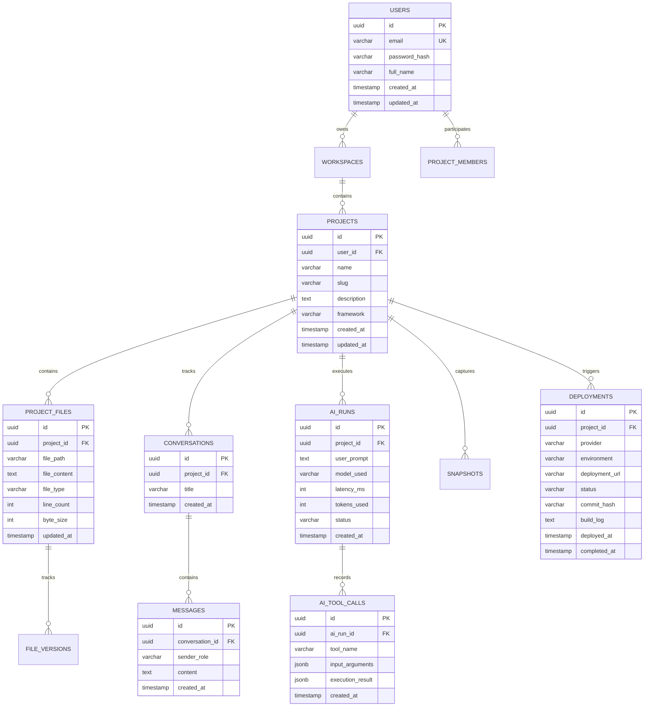

# 🗄️ Bolt.ai - PostgreSQL Database & 3NF Schema Architecture

## 1. Database Overview
Bolt.ai utilizes **PostgreSQL** configured in strict **Third Normal Form (3NF)** to ensure zero data redundancy, complete referential integrity, and optimal transactional observability across AI runs, conversations, file versions, and deployments.

### Connection Configuration
- **Database Engine**: PostgreSQL 16+
- **Environment Variable**:
  ```env
  DATABASE_URL=postgresql://${DB_USER}:${DB_PASSWORD}@${DB_HOST}:${DB_PORT}/${DB_NAME}
  ```

---

## 2. Entity-Relationship Diagram (3NF ERD)



---

## 3. PostgreSQL 3NF DDL Migration Script

```sql
-- PostgreSQL 3NF Schema Initialization for Bolt.ai

CREATE EXTENSION IF NOT EXISTS "uuid-ossp";

-- 1. Users Table
CREATE TABLE users (
    id UUID PRIMARY KEY DEFAULT uuid_generate_v4(),
    email VARCHAR(255) UNIQUE NOT NULL,
    password_hash VARCHAR(255) NOT NULL,
    full_name VARCHAR(150),
    created_at TIMESTAMP WITH TIME ZONE DEFAULT CURRENT_TIMESTAMP,
    updated_at TIMESTAMP WITH TIME ZONE DEFAULT CURRENT_TIMESTAMP
);

-- 2. Projects Table (Scoped unique slug per user)
CREATE TABLE projects (
    id UUID PRIMARY KEY DEFAULT uuid_generate_v4(),
    user_id UUID NOT NULL REFERENCES users(id) ON DELETE CASCADE,
    name VARCHAR(200) NOT NULL,
    slug VARCHAR(250) NOT NULL,
    description TEXT,
    framework VARCHAR(50) DEFAULT 'react-vite',
    created_at TIMESTAMP WITH TIME ZONE DEFAULT CURRENT_TIMESTAMP,
    updated_at TIMESTAMP WITH TIME ZONE DEFAULT CURRENT_TIMESTAMP,
    CONSTRAINT uq_user_project_slug UNIQUE (user_id, slug)
);

-- 3. Project Files Table
CREATE TABLE project_files (
    id UUID PRIMARY KEY DEFAULT uuid_generate_v4(),
    project_id UUID NOT NULL REFERENCES projects(id) ON DELETE CASCADE,
    file_path VARCHAR(500) NOT NULL,
    file_content TEXT NOT NULL,
    file_type VARCHAR(50) NOT NULL,
    line_count INTEGER NOT NULL DEFAULT 0,
    byte_size INTEGER NOT NULL DEFAULT 0,
    updated_at TIMESTAMP WITH TIME ZONE DEFAULT CURRENT_TIMESTAMP,
    CONSTRAINT uq_project_file UNIQUE (project_id, file_path)
);

-- 4. File Versions Table (Audit & Undo/Redo)
CREATE TABLE file_versions (
    id UUID PRIMARY KEY DEFAULT uuid_generate_v4(),
    file_id UUID NOT NULL REFERENCES project_files(id) ON DELETE CASCADE,
    version_number INTEGER NOT NULL,
    snapshot_code TEXT NOT NULL,
    created_at TIMESTAMP WITH TIME ZONE DEFAULT CURRENT_TIMESTAMP
);

-- 5. Conversations Table
CREATE TABLE conversations (
    id UUID PRIMARY KEY DEFAULT uuid_generate_v4(),
    project_id UUID NOT NULL REFERENCES projects(id) ON DELETE CASCADE,
    title VARCHAR(255) NOT NULL,
    created_at TIMESTAMP WITH TIME ZONE DEFAULT CURRENT_TIMESTAMP
);

-- 6. Messages Table
CREATE TABLE messages (
    id UUID PRIMARY KEY DEFAULT uuid_generate_v4(),
    conversation_id UUID NOT NULL REFERENCES conversations(id) ON DELETE CASCADE,
    sender_role VARCHAR(50) NOT NULL CHECK (sender_role IN ('user', 'assistant', 'system')),
    content TEXT NOT NULL,
    created_at TIMESTAMP WITH TIME ZONE DEFAULT CURRENT_TIMESTAMP
);

-- 7. AI Runs Observability Table
CREATE TABLE ai_runs (
    id UUID PRIMARY KEY DEFAULT uuid_generate_v4(),
    project_id UUID NOT NULL REFERENCES projects(id) ON DELETE CASCADE,
    user_prompt TEXT NOT NULL,
    model_used VARCHAR(100) NOT NULL,
    latency_ms INTEGER NOT NULL,
    tokens_used INTEGER NOT NULL,
    status VARCHAR(50) DEFAULT 'SUCCESS',
    created_at TIMESTAMP WITH TIME ZONE DEFAULT CURRENT_TIMESTAMP
);

-- 8. AI Tool Calls Table
CREATE TABLE ai_tool_calls (
    id UUID PRIMARY KEY DEFAULT uuid_generate_v4(),
    ai_run_id UUID NOT NULL REFERENCES ai_runs(id) ON DELETE CASCADE,
    tool_name VARCHAR(100) NOT NULL,
    input_arguments JSONB,
    execution_result JSONB,
    created_at TIMESTAMP WITH TIME ZONE DEFAULT CURRENT_TIMESTAMP
);

-- 9. Deployments Table
CREATE TABLE deployments (
    id UUID PRIMARY KEY DEFAULT uuid_generate_v4(),
    project_id UUID NOT NULL REFERENCES projects(id) ON DELETE CASCADE,
    provider VARCHAR(50) DEFAULT 'webcontainer',
    environment VARCHAR(50) DEFAULT 'production',
    deployment_url VARCHAR(500) NOT NULL,
    status VARCHAR(50) DEFAULT 'ACTIVE',
    commit_hash VARCHAR(64),
    build_log TEXT,
    deployed_at TIMESTAMP WITH TIME ZONE DEFAULT CURRENT_TIMESTAMP,
    completed_at TIMESTAMP WITH TIME ZONE
);

-- Indexing for Maximum Performance
CREATE INDEX idx_project_files_project ON project_files(project_id);
CREATE INDEX idx_file_versions_file ON file_versions(file_id);
CREATE INDEX idx_messages_conversation ON messages(conversation_id);
CREATE INDEX idx_ai_runs_project ON ai_runs(project_id);
CREATE INDEX idx_ai_tool_calls_run ON ai_tool_calls(ai_run_id);
CREATE INDEX idx_deployments_project ON deployments(project_id);
```
