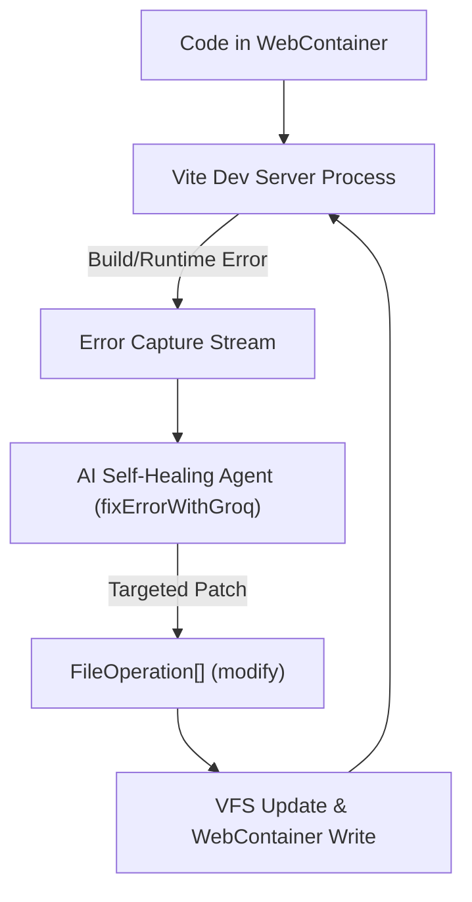

# ⚠️ Bolt.ai - Error Handling & Self-Healing Agent Architecture

## 1. Resilience & Self-Healing Loop

---

## 2. Multi-Tier Error Recovery

### A. Non-Silent Error Feedback
When Groq returns rate limit warnings or network anomalies, the system displays explicit error states (`"AI temporarily unavailable"`) with retry triggers rather than silently masking issues.

### B. Self-Healing Agent Integration (`fixErrorWithGroq`)
1. WebContainer compiler outputs error trace (e.g. `TS2304: Cannot find name 'useRef'`).
2. Error trace is combined with relevant project files and dispatched to `fixErrorWithGroq`.
3. Agent returns exact patch operations (e.g. modifying `src/App.tsx` to add `import { useRef } from 'react'`).
4. VFS updates the single file, and WebContainer hot-reloads the fix automatically.

### C. Live Diagnostics Scanner (Problems Tab)
- Continuously scans AST tokens in background for syntax pitfalls, missing closing tags, and unhandled `any` types.
- Provides interactive line-level jump navigation to the exact character in `LiveCodeEditor`.
