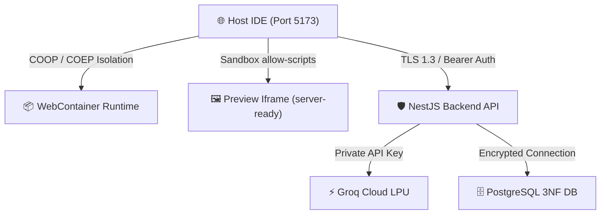

# 🔒 Bolt.ai - Security Policy & Threat Model

## 1. Security Architecture & Threat Vectors



---

## 2. Secrets Management & Credential Hygiene
1. **Zero Client-Side Secrets**:
   - Production Groq API keys and database credentials reside **exclusively in backend environment variables**.
   - No sensitive credentials, plaintext passwords, or private tokens are stored in documentation or committed to version control.
2. **Environment Variable Injection**:
   - WebContainer client IDs and development configurations are loaded via standard `VITE_` / `process.env` boundaries.

---

## 3. WebContainer & Iframe Sandbox Hardening
- **`Cross-Origin-Opener-Policy: same-origin`**: Ensures that top-level windows cannot be accessed by cross-origin documents.
- **`Cross-Origin-Embedder-Policy: require-corp`**: Protects local memory and threads (`SharedArrayBuffer`).
- **Iframe Sandboxing**:
  ```html
  <iframe sandbox="allow-scripts allow-same-origin allow-forms allow-modals" />
  ```
  Prevents unauthenticated parent window navigation or privileged cookie manipulation.
